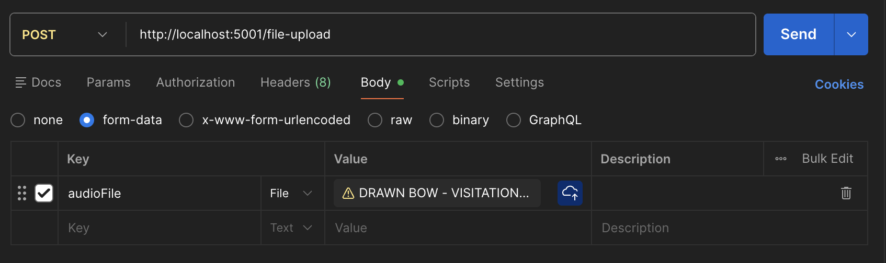
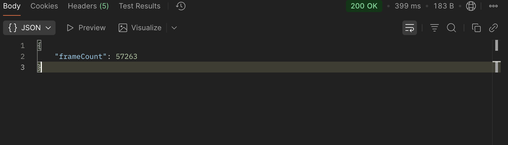

# Foundation-Health-Activity

## About
This is my attempt at the coding challenge for Foundation Health.  I decided to just use Node without express or a server framework out of curiousity because I have never done that.

I used this information from [Data Voyage](https://www.datavoyage.com/mpgscript/mpeghdr.htm) to learn how mp3 frame headers are constructed and how to calculate the length of a frame.

## Installation
Clone the repository and run `npm i` or `yarn` at the project root to install the dev dependencies.
Add a .env file with `PORT={port}` if you'd like to specify a port or the program will default to 5001

## Usage
Upload an mp3 file with postman/insomnia core or another api testing tool to `localhost:{PORT}/file-upload` Select POST request and body, form-data and enter the key audioFile with the file you'd like to test.

### Postman Form Data Selection

### Verify the Response With Media Info

